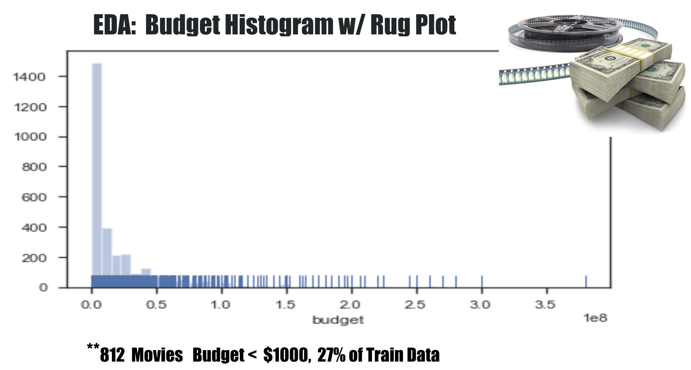
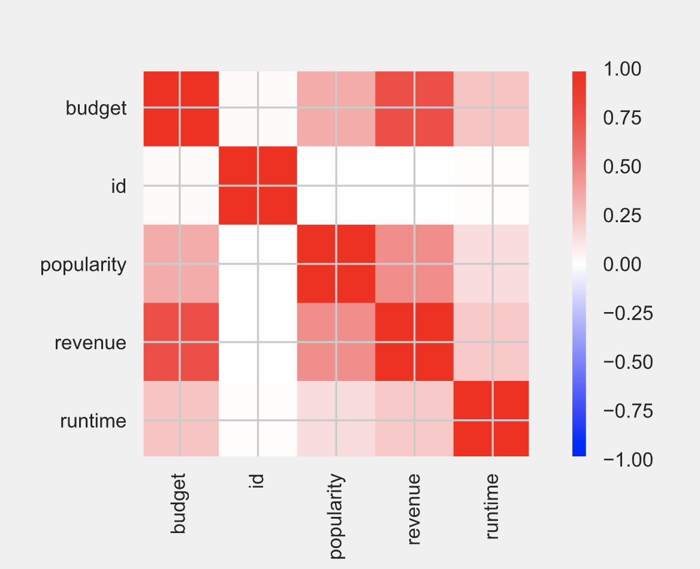
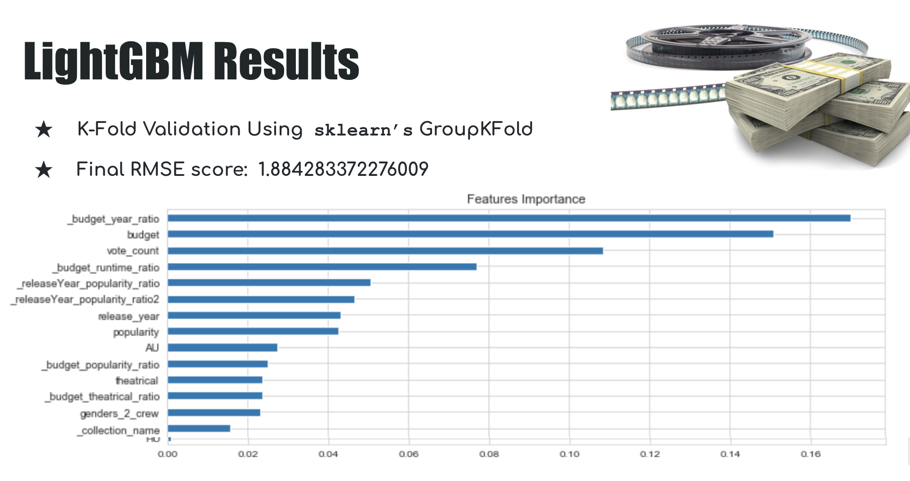

# Predict a Movie's Revenue

How can past data from The Movie Database (TMDB) help us build a predictive model of a movie's chances for success?  What are the best features helping to know how profitable a movie will be? Is it always true that high budget movies have the greatest chances for yielding the highest revenue?

In this project, the data used for this analysis is from a past Kaggle competition [here](https://www.kaggle.com/c/tmdb-box-office-prediction/data). Kaggle provides two main data files in csv format, a training and a test set. The target variable is a movie's revenue, which is omitted from the test set. After Exploratory Data Analysis (EDA), modeling will be done using two or more (as time allows) gradient boosting techniques. The end goal is a predictive model that tests well on the given testing data. 

## The Data 

Kaggle's Playground Prediction Competition "TMDB Box Office Prediction" closed five month's ago, but the data is still publicly available. Three additional datasets and modeling techniques were gleaned from [here](https://www.kaggle.com/zero92/tmdb-prediction/data). The data represents 3000 movies in the training set and 4398 in the test set. In addition to the train and test data, there were additional features and release dates added. 

## Exploratory Data Analysis

Many samples had a budget of under 1000 dollars. Other sources with more accurate data ere sought and imputed. Although the budget data appeared on the surface to be good data, it was found that many were at at close to zero. After consideration, movies with budget values of less than 1000 dollars were researched and imputed.

Early on, and as expected, the two most predictive features seemed to be budget and popularity. Later TMDB vote_count was added making the model better at predicting revenue, the target variable.

## Modeling

As a "quick look," an OLS from statsmodels was used using the budget and runtime features it confirmed the common sense notion and from the EDA, that budget had greater predictivity than runtime. However, the model scored poorly in that its R-squared value was only 0.546. Clearly more data and a better modeling technique might be what was needed. 

## Additional Features

Three new data files were concatenated to the training set. These files were also found on Kaggle. After further feature engineering, the data grew to 237 columns, such as genres, production companies, production countries, languages, keywords, cast and films, Feature engineering was helpful in producing more featuresfor example one-hot encoding the production companies. 

## Light Gradient Boosting Model

The ***LightGDM*** was utilized. For further information, see [here](https://lightgbm.readthedocs.io/en/latest/). Comparisons on this data were made during the Kaggle competition with CatBoost and XGBModel and LGBM had similar but slightly better results. Should more features be added, LGBM claims the advantage of being faster than the other two boosting style methods when the number of parameters grows in size. In the tests, the speed was similar for all three techniques. 

KFold Validation showed an average RMSE score of 1.884. In other words the model did very well on the test data.  Prominent feature importance was, in descending order: budget, vote_count, popularity, release year. Additionally, films made in Australia made better money than others. Although it had a relatively small feature importance, comedy genre films made more money than other genre films.

## Conclusions 

Early and careful data analysis was important. Finding such a high percentage of films with wrong data in the budget feature was an important discovery. That is, simply looking for null values wouldn't have sufficed and a bit of domain/common sense knowledge that a movie is never free to make led to seeking and imputing correct budget information. An iterative approach, including EDA and doing a "quick look" regression model was a good way of seeing the big picture in the data. The feature engineering led to further confirmation that budget was the most important predictive factor, with TMDB vote count and popularity close behind.

Further work can/should include continued efforts to include data, particularly text based studies like NLP/ML on pre-release press briefings and maybe commercials and their audience demographics. Perhaps other modeling techniques will be studied, too.

## Acknowledements

Much thanks to Kaggle competitor Baula Hanna, of the Université Denis Diderot in Paris who's feature engineering this project would have been much smaller in scope and accomplishment. His Kaggle site is [here](https://www.kaggle.com/zero92/tmdb-prediction/data). Please "upvote" him as much as possible, his kind generosity in data engineering and providing the "just for fun" data, as he called it, proves to me he deserves it.
